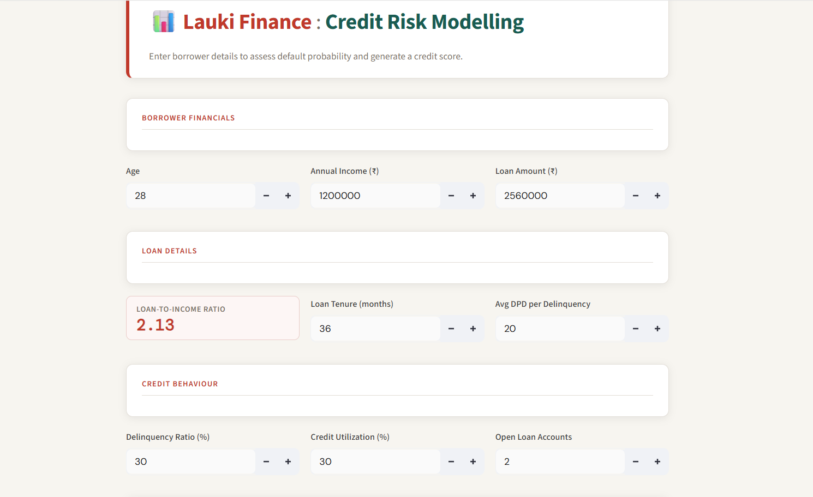
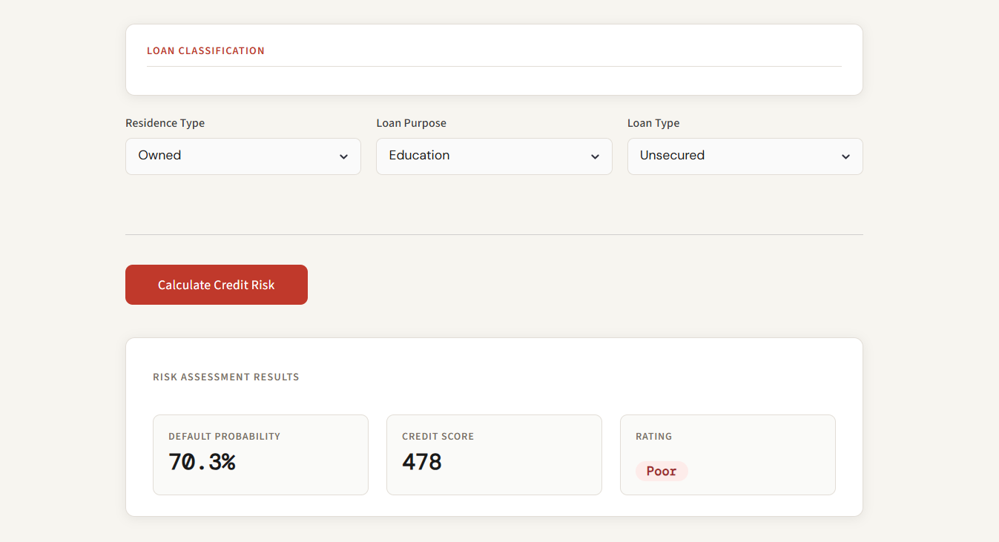

# 💳 Credit Risk Default Prediction using Machine Learning

> Predicting loan default risk using Machine Learning to help financial institutions identify high-risk customers and make informed lending decisions.

---

## 📖 Project Overview

Credit risk modelling is one of the most important applications of Machine Learning in the banking and finance industry.

In this project, I built an end-to-end Credit Risk Prediction system that predicts whether a customer is likely to default on a loan based on customer demographics, loan details, and bureau information.

The project includes:

- Data Cleaning & Preprocessing
- Feature Engineering
- Handling Imbalanced Data
- Feature Selection
- Model Training
- Hyperparameter Tuning
- Model Evaluation
- Streamlit Web Application

---

# 📸 Application Screenshots

## Home Page



---

## Prediction Result



---

# 🚀 Tech Stack

| Category | Technologies |
|-----------|--------------|
| Language | Python |
| Libraries | Pandas, NumPy, Scikit-Learn |
| Models | Logistic Regression, Random Forest, XGBoost |
| Hyperparameter Tuning | RandomizedSearchCV, Optuna |
| Imbalanced Data | SMOTE, UnderSampling |
| Model Evaluation | ROC-AUC, Gini, KS Statistic, Rank Ordering |
| Deployment | Streamlit |
| Model Serialization | Joblib |

---

# 📂 Dataset

The dataset contains information about

- Customer Details
- Loan Information
- Credit Bureau Information

Target Variable

```
Default
```

- 1 → Customer Defaulted

- 0 → Customer Did Not Default

---


````markdown
# ⚙️ Project Workflow

| Stage | Description |
|--------|-------------|
| 📂 Dataset | Customer, Loan and Bureau data with **Default** as the target variable |
| 🧹 Data Preprocessing | Missing value treatment, invalid value handling, feature engineering, scaling and feature selection using IV, VIF and domain knowledge |
| ✂️ Train-Test Split | 75% Training, 25% Testing |
| 🤖 Model Training | Logistic Regression, Random Forest and XGBoost with **SMOTE and Undersampling** to handle class imbalance |
| ⚙️ Hyperparameter Optimization | RandomizedSearchCV and Optuna |
| 📊 Model Evaluation | ROC-AUC, KS Statistic, Gini Coefficient, Rank Ordering and Classification Report |
| 🚀 Deployment | Streamlit Web Application |

---

# 🤖 Machine Learning Models

The following models were trained and compared.

| Model | Description |
|--------|-------------|
| Logistic Regression | Baseline Classification Model |
| Random Forest | Ensemble Learning |
| XGBoost | Gradient Boosting Model |

---

# 🔧 Hyperparameter Tuning

To improve model performance,

- RandomizedSearchCV
- Optuna

were used for hyperparameter optimization.

---

# 📊 Model Evaluation

The models were evaluated using

- ROC-AUC Score
- Gini Coefficient
- KS Statistic
- Rank Ordering
- Classification Report

---

# 📈 Final Model Performance

| Metric | Score |
|----------|--------|
| ROC-AUC | **98%** |
| Gini Coefficient | **96%** |
| Top 3 Decile Capture Rate | **99.53%** |

---

# 🎯 Key Insights

✅ Excellent discrimination between defaulters and non-defaulters.

✅ Strong rank ordering capability.

✅ High KS Statistic indicating effective separation of risky and safe customers.

✅ Successfully identified high-risk customers with excellent predictive performance.

---

# 💻 Installation

Clone the repository

```bash
git clone https://github.com/Likhitha1234-lab/ml-project-credit-risk-model.git
```

Move into the project

```bash
cd ml-project-credit-risk-model
```

Install dependencies

```bash
pip install -r requirements.txt
```

Run the Streamlit application

```bash
streamlit run main.py
```

---

# 📁 Project Structure

```
ml-project-credit-risk-model
│
├── artifacts
├── screenshots
├── main.py
├── prediction_helper.py
├── requirements.txt
├── README.md
```

---

# 👩‍💻 Author

**Likhitha N**

Aspiring AI & Data Scientist

- Python
- Machine Learning
- Statistics
- SQL
- Streamlit
- XGBoost

---